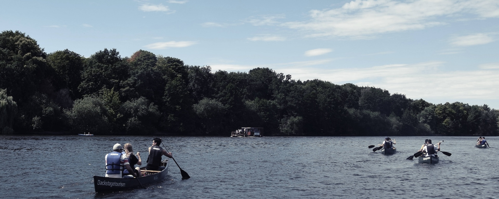

# One Future e.V.

Im Herbst 2015 haben wir den gemeinnützigen Verein One Future e.V. aus einer Schülerinitiative des Europäischen Gymnasiums Bertha-von-Suttner gebildet. Der Verein wird von Jugendlichen und Schüler*innen komplett ehrenamtlich geleitet. 

Aus eigener Erfahrung wissen wir, dass viele Schülerinnen und Schüler bereit sind zu helfen und in den Kontakt mit Geflüchteten zu treten, wenn sie die Chance dazu bekommen. Wir sehen unsere Aufgabe darin, junge Menschen bei ihrem gesellschaftlichen Engagement zu unterstützen.

Das Ziel des Vereins ist die Förderung von kulturellem Verständnis zwischen Geflüchteten und Schüler*innen sowie die Steigerung der Partizipation von Schüler*innen. Um diese Ziele zu verwirklichen, initiiert der Verein Begegnungsprojekte, bei denen Schüler*innen und Geflüchtete miteinander in den Kontakt kommen. Alle Projekte werden von jungen Menschen mit und ohne Fluchterfahrung organisiert. Unsere Vision haben wir bereits mit Schüler*innen aus ganz Deutschland während unseres Seminars [Aktion Zukunft](http://www.aktionzukunft.de) geteilt.

[Offizieller Flyer von One Future e.V.](https://one-future.de/images/pdfs/Aus_Fremden_werden_Freunde.pdf)